# REST DataHub Studio Control (rdsctl) Documentation

## Table of Contents
- [Introduction](#1-introduction)
- [Prerequisites](#2-prerequisites)
- [Installation](#3-installation)
- [Command Line Usage](#4-command-line-usage)
  - [up - Start Docker Compose Services](#4.1-up---start-docker-compose-services)
  - [build - Build Docker Compose Services](#4.2-build---build-docker-compose-services)
  - [down - Stop Docker Compose Services](#4.3-down---stop-docker-compose-services)
  - [logs - View Docker Compose Logs](#4.4-logs---view-docker-compose-logs)
- [ Usage Examples](#5-usage-examples)
  - [Starting Services](##5.1-starting-services)
  - [Building Services](#5.2-building-services)
  - [Stopping Services](#5.3-stopping-services)
  - [Viewing Logs](#5.4-viewing-logs)
- [Troubleshooting](#6-troubleshooting)
- [Frequently Asked Questions (FAQ)](#7-frequently-asked-questions-faq)
- [Contact Information](#8-contact-information)
- [License](#9-license)

## 1. Introduction
The **rdsctl** tool is a command-line utility for managing Docker Compose services within different flows of the REST DataHub Studio project.
### Project Documentation

Here is a list of documentation files for this project:

- [AdminFlow Documentation](./documentation/AdminFlow.md)
- [GeneVariant-ClinicalTrial Documentation](./documentation/GeneVariant-ClinicalTrial.md)
- [GeneVariant-Gene Documentation](./documentation/GeneVariant-Gene.md)
- [GeneVariant-Lab Documentation](./documentation/GeneVariant-Lab.md)
- [GeneVariant-MedicalHistory Documentation](./documentation/GeneVariant-MedicalHistory.md)
- [GeneVariant-Patient Documentation](./documentation/GeneVariant-Patient.md)
- [GeneVariant-Researcher Documentation](./documentation/GeneVariant-Researcher.md)
- [GeneVariant-Variant Documentation](./documentation/GeneVariant-Variant.md)
- [TasksFlow Documentation](./documentation/TasksFlow.md)
- [UserFlow Documentation](./documentation/UserFlow.md)

You can click on each link to access the corresponding documentation.

Feel free to explore the documentation to learn more about this project.

## REST DataHub Studio Architecture 

```mermaid
flowchart TD
  subgraph DockerCompose
    subgraph AdminMicroservice
      AdminRegistration --> AssignRoleToEntity
      AssignRoleToEntity --> UpdateAdmin
      UpdateAdmin --> DeleteAdmin
      DeleteAdmin --> ListAdmins
      ListAdmins --> ApproveUser
      ApproveUser --> RevokeUser
    end

    subgraph UserMicroservice
      UserRegistration --> UserLogin
      UserLogin --> GetAllUsers
      GetAllUsers --> GetUserByID
      GetUserByID --> UpdateUser
      UpdateUser --> DeleteUser
    end

    subgraph VariantRecordsMicroservice
      CreateVariant --> GetAllVariants
      GetAllVariants --> GetVariantByID
      GetVariantByID --> UpdateVariantByID
      UpdateVariantByID --> DeleteVariantByID
    end

    subgraph ClinicalTrialMicroservice
      CreateClinicalTrial --> GetAllClinicalTrials
      GetAllClinicalTrials --> GetClinicalTrialByID
      GetClinicalTrialByID --> UpdateClinicalTrialByID
      UpdateClinicalTrialByID --> DeleteClinicalTrialByID
    end

    subgraph GeneMicroservice
      CreateGene --> GetAllGenes
      GetAllGenes --> GetGeneByID
      GetGeneByID --> UpdateGeneByID
      UpdateGeneByID --> DeleteGeneByID
    end

    subgraph LabMicroservice
      CreateLab --> GetAllLabs
      GetAllLabs --> GetLabByID
      GetLabByID --> UpdateLabByID
      UpdateLabByID --> DeleteLabByID
    end

    subgraph MedicalHistoryMicroservice
      CreateMedicalHistory --> GetAllMedicalHistories
      GetAllMedicalHistories --> GetMedicalHistoryByID
      GetMedicalHistoryByID --> UpdateMedicalHistoryByID
      UpdateMedicalHistoryByID --> DeleteMedicalHistoryByID
    end

    subgraph PatientMicroservice
      CreatePatient --> GetAllPatients
      GetAllPatients --> GetPatientByID
      GetPatientByID --> UpdatePatientByID
      UpdatePatientByID --> DeletePatientByID
    end

    subgraph ResearcherMicroservice
      CreateResearcher --> GetAllResearchers
      GetAllResearchers --> GetResearcherByID
      GetResearcherByID --> UpdateResearcherByID
      UpdateResearcherByID --> DeleteResearcherByID
    end

    subgraph Gateway
      APIGateway
    end

    AdminRegistration --> APIGateway
    AssignRoleToEntity --> APIGateway
    UpdateAdmin --> APIGateway
    DeleteAdmin --> APIGateway
    ListAdmins --> APIGateway
    ApproveUser --> APIGateway
    RevokeUser --> APIGateway
    UserRegistration --> APIGateway
    UserLogin --> APIGateway
    GetAllUsers --> APIGateway
    GetUserByID --> APIGateway
    UpdateUser --> APIGateway
    DeleteUser --> APIGateway
    CreateVariant --> APIGateway
    GetAllVariants --> APIGateway
    GetVariantByID --> APIGateway
    UpdateVariantByID --> APIGateway
    DeleteVariantByID --> APIGateway
    CreateClinicalTrial --> APIGateway
    GetAllClinicalTrials --> APIGateway
    GetClinicalTrialByID --> APIGateway
    UpdateClinicalTrialByID --> APIGateway
    DeleteClinicalTrialByID --> APIGateway
    CreateGene --> APIGateway
    GetAllGenes --> APIGateway
    GetGeneByID --> APIGateway
    UpdateGeneByID --> APIGateway
    DeleteGeneByID --> APIGateway
    CreateLab --> APIGateway
    GetAllLabs --> APIGateway
    GetLabByID --> APIGateway
    UpdateLabByID --> APIGateway
    DeleteLabByID --> APIGateway
    CreateMedicalHistory --> APIGateway
    GetAllMedicalHistories --> APIGateway
    GetMedicalHistoryByID --> APIGateway
    UpdateMedicalHistoryByID --> APIGateway
    DeleteMedicalHistoryByID --> APIGateway
    CreatePatient --> APIGateway
    GetAllPatients --> APIGateway
    GetPatientByID --> APIGateway
    UpdatePatientByID --> APIGateway
    DeletePatientByID --> APIGateway
    CreateResearcher --> APIGateway
    GetAllResearchers --> APIGateway
    GetResearcherByID --> APIGateway
    UpdateResearcherByID --> APIGateway
    DeleteResearcherByID --> APIGateway
  end

  subgraph Roles
    subgraph Superadmin
      FullControlOverUserAndAdminManagement --> ManageRolesAndPermissions
      ManageRolesAndPermissions --> AccessSystemWideConfigurations
      AccessSystemWideConfigurations --> ManagePharmaceuticalData
      AccessSystemWideConfigurations --> ManageClinicalData
      AccessSystemWideConfigurations --> ManageGeneData
      AccessSystemWideConfigurations --> ManageAdverseEventsData
      AccessSystemWideConfigurations --> ManageVariantsData
      AccessSystemWideConfigurations --> ManageMedicalData
    end

    subgraph Admin
      ManageUserAccounts --> AssignRolesAndPermissions
      AssignRolesAndPermissions --> AccessAdminDashboard
    end

    subgraph PharmaceuticalDataManager
      ManagePharmaceuticalDatasets --> ManageDataSchemasAndConfigurations
      ManagePharmaceuticalDatasets --> AccessDataImportTools
    end

    subgraph ClinicalDataManager
      ManageClinicalDatasets --> ManageDataSchemasAndConfigurations
      ManageClinicalDatasets --> AccessDataImportTools
    end

    subgraph GeneDataManager
      ManageGeneDatasets --> ManageDataSchemasAndConfigurations
      ManageGeneDatasets --> AccessDataImportTools
    end

    subgraph AdverseEventsDataManager
      ManageAdverseEventsDatasets --> ManageDataSchemasAndConfigurations
      ManageAdverseEventsDatasets --> AccessDataImportTools
    end

    subgraph VariantsDataManager
      ManageVariantsDatasets --> ManageDataSchemasAndConfigurations
      ManageVariantsDatasets --> AccessDataImportTools
    end

    subgraph MedicalDataManager
      ManageMedicalDatasets --> ManageDataSchemasAndConfigurations
      ManageMedicalDatasets --> AccessDataImportTools
    end

    subgraph PharmaceuticalDepartmentUser
      AccessPharmaceuticalData --> RetrieveAndUsePharmaceuticalData
    end

    subgraph ClinicalDepartmentUser
      AccessClinicalData --> RetrieveAndUseClinicalData
    end

    subgraph GeneticsDepartmentUser
      AccessGeneData --> RetrieveAndUseGeneData
    end

    subgraph SafetyDepartmentUser
      AccessAdverseEventsData --> RetrieveAndUseAdverseEventsData
    end

    subgraph ResearchDepartmentUser
      AccessVariantsData --> AccessMedicalData
      AccessVariantsData --> RetrieveAndUseVariantsAndMedicalData
    end
  end

  Superadmin --> ManageRolesAndPermissions
  Admin --> ManageUserAccounts
  Admin --> AssignRolesAndPermissions
  Admin --> AccessAdminDashboard
  PharmaceuticalDataManager --> ManagePharmaceuticalDatasets
  PharmaceuticalDataManager --> ManageDataSchemasAndConfigurations
  PharmaceuticalDataManager --> AccessDataImportTools
  ClinicalDataManager --> ManageClinicalDatasets
  ClinicalDataManager --> ManageDataSchemasAndConfigurations
  ClinicalDataManager --> AccessDataImportTools
  GeneDataManager --> ManageGeneDatasets
  GeneDataManager --> ManageDataSchemasAndConfigurations
  GeneDataManager --> AccessDataImportTools
  AdverseEventsDataManager --> ManageAdverseEventsDatasets
  AdverseEventsDataManager --> ManageDataSchemasAndConfigurations
  AdverseEventsDataManager --> AccessDataImportTools
  VariantsDataManager --> ManageVariantsDatasets
  VariantsDataManager --> ManageDataSchemasAndConfigurations
  VariantsDataManager --> AccessDataImportTools
  MedicalDataManager --> ManageMedicalDatasets
  MedicalDataManager --> ManageDataSchemasAndConfigurations
  MedicalDataManager --> AccessDataImportTools
  PharmaceuticalDepartmentUser --> RetrieveAndUsePharmaceuticalData
  ClinicalDepartmentUser --> RetrieveAndUseClinicalData
  GeneticsDepartmentUser --> RetrieveAndUseGeneData
  SafetyDepartmentUser --> RetrieveAndUseAdverseEventsData
  ResearchDepartmentUser --> AccessMedicalData
  ResearchDepartmentUser --> RetrieveAndUseVariantsAndMedicalData



```



## 2. Prerequisites
Before using **rdsctl**, ensure you have the following prerequisites:

- Docker Compose installed
- Python 3.x
- Pip package manager

## 3. Installation
There is no specific installation required for **rdsctl**. You can simply download the script and use it as described in the [Command Line Usage](#4-command-line-usage) section.

## 4. Command Line Usage
The **rdsctl** tool provides several commands for managing Docker Compose services within different flows of the REST DataHub Studio project.

### 4.1. up - Start Docker Compose Services
Start Docker Compose services for a specific flow or services within a flow.

```shell
rdsctl up <flow> [options]
```

Options:
- `--all`: Start all services for the specified flow.

### 4.2. build - Build Docker Compose Services
Build Docker Compose services for a specific flow or services within a flow.

```shell
rdsctl build <flow> [options]
```

Options:
- `--all`: Build all services for the specified flow.

### 4.3. down - Stop Docker Compose Services
Stop Docker Compose services for a specific flow or a specific service within a flow.

```shell
rdsctl down <flow> [service] [options]
```

Options:
- `--all`: Stop all services for the specified flow.
- `--remove-orphans`: Remove orphaned containers.

### 4.4. logs - View Docker Compose Logs
View Docker Compose logs for a specific flow or a specific service within a flow.

```shell
rdsctl logs <flow> [service] [options]
```

Options:
- `--all`: View logs for all services in the specified flow.
- `-f`: Follow log output.

## 5. Usage Examples
Here are some examples of how to use the **rdsctl** tool.

### Starting Services
Start all services for the `AuthFlow`:

```shell
rdsctl up AuthFlow --all
```

Explanation:
- `up`: This command is used to start Docker Compose services.
- `AuthFlow`: Specifies the flow for which you want to start services.
- `--all`: This option is used to start all services within the specified flow.

### Starting Specific Services
Start specific services within the `DataFlow`:

```shell
rdsctl up DataFlow GeneVariant
```

Explanation:
- `up`: Start Docker Compose services.
- `DataFlow`: The target flow.
- `GeneVariant`: Specific service within the `DataFlow` to start.

### Building Services
Build all services for the `PostgresFlow`:

```shell
rdsctl build UtilFlow PostgresFlow --all
```

Explanation:
- `build`: This command is used to build Docker Compose services.
- `UtilFlow`: Specifies the flow where the service is located.
- `PostgresFlow`: The specific service within `UtilFlow` to build.
- `--all`: This option is used to build all services within the specified flow.

### Stopping Services
Stop all services for the `AuthFlow` and remove orphaned containers:

```shell
rdsctl down AuthFlow --all --remove-orphans
```

Explanation:
- `down`: This command is used to stop Docker Compose services.
- `AuthFlow`: Specifies the flow for which you want to stop services.
- `--all`: Stop all services within the specified flow.
- `--remove-orphans`: Remove any orphaned containers associated with the services.

### Stopping a Specific Service
Stop the `AdminUserFlow` service within the `AuthFlow`:

```shell
rdsctl down AuthFlow AdminUserFlow
```

Explanation:
- `down`: Stop Docker Compose services.
- `AuthFlow`: The target flow.
- `AdminUserFlow`: The specific service within `AuthFlow` to stop.

### Viewing Logs
View logs for all services in the `DataFlow`:

```shell
rdsctl logs DataFlow --all -f
```

Explanation:
- `logs`: This command is used to view Docker Compose logs.
- `DataFlow`: The flow for which you want to view logs.
- `--all`: View logs for all services within the specified flow.
- `-f`: Follow the log output in real-time.

### Viewing Logs for a Specific Service
View logs for the `PGAdminFlow` service within the `UtilFlow`:

```shell
rdsctl logs UtilFlow PGAdminFlow
```

Explanation:
- `logs`: View Docker Compose logs.
- `UtilFlow`: The flow where the service is located.
- `PGAdminFlow`: The specific service within `UtilFlow` to view logs for.

### Purging Services
Purge (stop and remove) all services for the `GeneVariant`:

```shell
rdsctl purge DataFlow GeneVariant --all
```

Explanation:
- `purge`: This command is used to stop and remove Docker Compose services.
- `DataFlow`: The flow for which you want to purge services.
- `GeneVariant`: Specific service within `DataFlow` to purge.
- `--all`: Purge all services within the specified flow.

These examples cover a range of operations you can perform with the **rdsctl** tool, including starting, building, stopping, viewing logs, and purging services within different flows of the REST DataHub Studio project.

## 6. Troubleshooting
If you encounter any issues or errors while using **rdsctl**, please refer to the [Frequently Asked Questions (FAQ)](#7-frequently-asked-questions-faq) section for solutions.

## 7. Frequently Asked Questions (FAQ)
- **Q:** How do I install Docker Compose?
  - **A:** You can install Docker Compose by following the instructions provided on the official Docker documentation.

- **Q:** I'm getting an error when running **rdsctl**. What should I do?
  - **A:** Ensure that you have met all the prerequisites mentioned in the [Prerequisites](#2-prerequisites) section. If the issue persists, consult the troubleshooting section (Section 6) or contact our support team.

## 8. Contact Information
For any further assistance or inquiries, please contact our support team at [support@restdatahubstudio.com](mailto:support@restdatahubstudio.com).

## 9. License
**Custom Non-Commercial Open Source License (CNCO)**

**Version 1.0**

**Permissions:**
- You are permitted to use, run, and contribute to this software for personal, educational, or non-commercial purposes.

**Prohibitions:**
- You are not permitted to make copies of this software and maintain separate repositories.
- You are not allowed to distribute this software for commercial purposes.
- You are not allowed to sublicense this software or modify it in a way that violates these terms.

**Contributions:**
- Contributions to this project are welcomed and must adhere to the terms of this license.

This software is provided "as is," without warranty of any kind, express or implied.
By using or contributing to this software, you agree to abide by the terms of this license.

For more details, see the LICENSE file in this repository.
